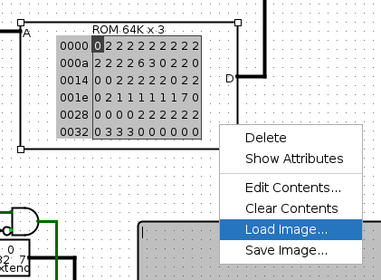
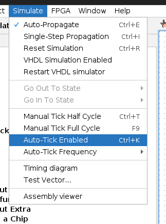

# Enchanted Stone

Enchanted Stone is a [logisim-evolution](https://github.com/logisim-evolution/logisim-evolution)
CPU that runs brainfuck instructions. An accurate (and better performing) software simulator is
also present.

#### Disclaimer

This is a beginner project and I have no experience in CPU design. What I did may as well be magic,
hence the project name. Nevertheless, it was a fun side project!

## Getting started

The first step is to build the toolchain. It supports software CPU simulation and conversion from
brainfuck code to binary logisim-evolution ROMs.

```
$ make
```

#### Using the CPU

Before using the CPU, brainfuck code needs to be converted to a logisim-evolution ROM. To do it,
run:

```
$ ./toolchain bin [input file]
```

This outputs the ROM to `stdout`. Redirect it to the target output file. For example:

```
$ ./toolchain bin helloworld.bf > helloworld.bin
```

To load it into logisim-evolution, right-click on the ROM component on the `main` circuit and
choose "Load Image...". Select the binary file the toolchain created.



Start the simulation by going to `Simulate -> Auto-Tick Enabled` or pressing `Ctrl+K`. The CPU's
frequency can also be adjusted on the `Simulate` menu.



#### Simulator

The toolchain includes a simulator. It is written in C for better performance, but it doesn't do
any fancy optimizations, as it was designed to behave like the CPU. To run a file:

```
$ ./toolchain sim [input file]
```

The simulator tries to emulate the CPU. Though, there are some differences to be noted:

- When the end of the program is reached, the simulator stops running. Meanwhile, the CPU asks for
  user input (not implemented yet), therefore halting the system.

- The simulator segfaults when reading / writing outside of the memory array. On the other hand,
  the CPU will likely read / write from the wrong address.

## Future goals

- Support for user input
- Documentation
- `[-]` optimization (set cell to zero)
- Error detection
